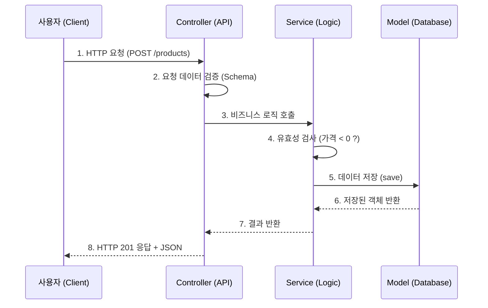

# 개발 가이드 (Development Guide)

이 문서는 프로젝트의 아키텍처를 이해하고, 새로운 기능을 처음부터 끝까지 개발하는 방법을 단계별로 설명하는 **초급자용 가이드**입니다.

---

## 🏗️ 아키텍처 개요 (Architecture Overview)

이 프로젝트는 **Layered Architecture (계층형 아키텍처)**를 따릅니다.
데이터의 흐름은 `Controller -> Service -> Model -> Database` 순서로 진행됩니다.

### 1. **Controller (API Layer)** (`app/api/`)
- **역할**: 클라이언트의 HTTP 요청을 받고, 적절한 응답을 반환합니다.
- **책임**: 요청 데이터 파싱, 유효성 검사 트리거, Service 호출, HTTP 상태 코드 결정.
- **비즈니스 로직을 포함하지 않습니다.**

### 2. **Service Layer** (`app/services/`)
- **역할**: 실제 비즈니스 로직을 수행합니다.
- **책임**: 데이터 가공, 계산, 여러 데이터베이스 연산의 트랜잭션 관리.
- **예**: "회원가입 시 이메일 중복 체크 후, 비밀번호를 암호화하여 저장한다."

### 3. **Model Layer** (`app/models/`)
- **역할**: 데이터베이스 테이블과 매핑되는 객체(Entity)를 정의합니다.
- **책임**: 데이터 구조 정의, 간단한 데이터 무결성 로직(예: 비밀번호 해싱).

### 4. **Schema Layer** (`app/schemas/`)
- **역할**: API 요청/응답 데이터의 **형식(Structure)**을 정의하고 검증합니다.
- **도구**: `flask-restx`의 `Namespace`와 `fields`를 사용합니다.

### 🔄 데이터 흐름도 (Sequence Diagram)



---

## 🚀 기능 구현 가이드 (Step-by-Step)

새로운 기능(예: "상품 관리")을 추가한다고 가정하고 단계별로 알아봅니다.

### Step 1. 모델(Model) 정의 (DB 설계)
데이터를 어떻게 저장할지 정의합니다. `app/models/base.py`의 `BaseModel`을 상속받아 기본적인 CRUD 기능을 무료로 얻으세요.

**파일**: `app/models/product.py`
```python
from app.extensions import db
from app.models.base import BaseModel

class Product(BaseModel):
    __tablename__ = "products"

    name = db.Column(db.String(100), nullable=False)
    price = db.Column(db.Integer, nullable=False)
    stock = db.Column(db.Integer, default=0)

    # 비즈니스와 밀접한 간단한 로직은 모델에 넣어도 됩니다.
    def is_in_stock(self):
        return self.stock > 0
```
> **Tip**: 모델을 만들면 `app/__init__.py`나 `migrations/env.py` 등에서 import 해야 마이그레이션이 인식될 수 있습니다.

### Step 2. 스키마 정의 (Schema Definition)
클라이언트가 보낼 데이터(Request)와 우리가 돌려줄 데이터(Response)의 모양을 정의합니다.

**파일**: `app/schemas/product.py`
```python
from flask_restx import Namespace, fields

# 1. Namespace 생성 (URL 경로의 기준이 됨)
api = Namespace("products", description="상품 관리 API")

# 2. 요청 모델 (Input)
product_req = api.model("ProductRequest", {
    "name": fields.String(required=True, description="상품명"),
    "price": fields.Integer(required=True, min=0, description="가격"),
})

# 3. 응답 모델 (Output)
product_resp = api.model("ProductResponse", {
    "id": fields.Integer(description="상품 ID"),
    "name": fields.String(description="상품명"),
    "price": fields.Integer(description="가격"),
    "stock": fields.Integer(description="재고"),
    "created_at": fields.DateTime(description="생성일"),
})
```

### Step 3. 서비스(Service) 구현 (비즈니스 로직)
실제 기능을 구현합니다. Controller가 호출할 함수들을 만듭니다.

**파일**: `app/services/product_service.py`
```python
from app.models.product import Product
from app.extensions import db

class ProductService:
    @staticmethod
    def create_product(data):
        # 1. 로직 수행 (예: 가격 검증)
        if data['price'] < 0:
            raise ValueError("가격은 0보다 커야 합니다.")

        # 2. 데이터 저장
        product = Product(name=data['name'], price=data['price'])
        product.save() # BaseModel이 제공하는 메서드
        return product

    @staticmethod
    def get_all_products():
        return Product.query.all()
```

### Step 4. 컨트롤러 구현 및 Swagger 문서화 (Controller & Swagger Docs)
Schema와 Service를 연결하고 API 엔드포인트를 만듭니다. 여기서 **데코레이터**들이 핵심 역할을 합니다.

**파일**: `app/api/v1/products.py`
```python
from flask import request
from flask_restx import Resource
from app.schemas.product import api, product_req, product_resp
from app.services.product_service import ProductService

# 스키마에서 만든 api 객체를 사용합니다.
@api.route("")
class ProductList(Resource):
    
    # 📝 데코레이터 상세 설명 (Decorator Reference)
    
    # 1. @api.expect(model, validate=True)
    # - 역할: 클라이언트가 보낸 JSON 데이터(Request Body)를 검증합니다.
    # - validate=True: 모델 정의와 다르면 400 Bad Request 에러를 자동 반환합니다.
    @api.expect(product_req, validate=True) 

    # 2. @api.marshal_with(model, code=200)
    # - 역할: 파이썬 객체(딕셔너리, DB 모델 등)를 JSON 응답으로 변환(직렬화)합니다.
    # - 효과: 모델에 정의되지 않은 필드는 자동으로 제외되어 보안성을 높여줍니다.
    @api.marshal_with(product_resp, code=201)

    # 3. @api.response(code, description)
    # - 역할: Swagger UI에 해당 상태 코드의 의미를 문서화합니다.
    @api.response(201, "상품 등록 성공")
    @api.response(400, "잘못된 입력값")
    
    # 4. @api.doc(security="Bearer")
    # - 역할: 자물쇠 아이콘을 표시하고 인증이 필요함을 명시합니다. (JWT 사용 시)
    # @api.doc(security="Bearer") 

    def post(self):
        """상품 등록"""
        try:
            # Service 호출
            return ProductService.create_product(request.json), 201
        except ValueError as e:
            api.abort(400, str(e)) # 예외 처리
```

#### 💡 데코레이터 심화 가이드
| 데코레이터              | 주요 옵션                           | 설명                                                                                                    |
| :---------------------- | :---------------------------------- | :------------------------------------------------------------------------------------------------------ |
| **`@api.expect`**       | `validate=True`                     | 요청 데이터가 Schema와 일치하는지 엄격 검사합니다. 필수 필드 누락 시 에러 발생.                         |
| **`@api.marshal_with`** | `code=200`, `envelope='data'`       | 리턴값을 Schema 포맷에 맞게 필터링 및 변환합니다. `envelope` 사용 시 `{"data": {...}}` 형태로 감쌉니다. |
| **`@api.doc`**          | `security`, `params`, `description` | 문서화 전용입니다. 보안 설정, 쿼리 파라미터(`?page=1`), 상세 설명을 추가할 때 씁니다.                   |

### Step 5. 등록 (Register)
마지막으로, 만든 컨트롤러(`Namespace` 객체)를 앱에 등록해야 합니다.

**파일**: `app/api/v1/__init__.py`
```python
# ... 기존 import
from app.api.v1.products import api as products_ns # import

# ...
api.add_namespace(products_ns, path="/products") # 등록
```

---

## 🧪 테스트 (Testing)

코드 작성만큼 테스트도 중요합니다. 자세한 작성법과 실행 방법은 **[테스트 코드 가이드 (Test Code Guide)](test_code_guide.md)**를 참고하세요.

```bash
# 전체 테스트 실행
pytest
```


## 💡 주요 규칙 (Convention)

1.  **명명 규칙**: 파일명은 `snake_case`, 클래스명은 `PascalCase`를 사용합니다.
2.  **DTO 분리**: `app/schemas/`에 API 모델을 정의하고, Controller는 이를 import해서 사용합니다.
3.  **마이그레이션**: 모델을 변경하면 DB에 반영해야 합니다. 자세한 명령어는 **[DB 가이드 (Database Guide)](database_guide.md)**를 참고하세요.

---

## ❓ 자주 하는 실수와 해결법 (Troubleshooting)

### Q1. "ImportError: cannot import name..." 에러가 나요.
- **원인**: 순환 참조(Circular Import)가 발생했거나, 파일이나 변수 이름이 틀렸을 수 있습니다.
- **해결**: A파일이 B를 import하는데, B파일이 다시 A를 import하는지 확인하세요.

### Q2. DB에 데이터가 안 들어가요.
- **원인**: `db.session.commit()`이 호출되지 않았기 때문입니다.
- **해결**: `save()` 메서드(내부적으로 commit 포함)를 사용했는지, 혹은 Service에서 명시적으로 commit 했는지 확인하세요.

### Q3. Swagger에 API가 안 떠요.
- **원인**: 새로운 Controller 파일을 만들고 `__init__.py`에 등록하지 않아서입니다.
- **해결**: `app/api/v1/__init__.py` 파일에 `api.add_namespace(...)` 코드를 추가했는지 확인하세요.
